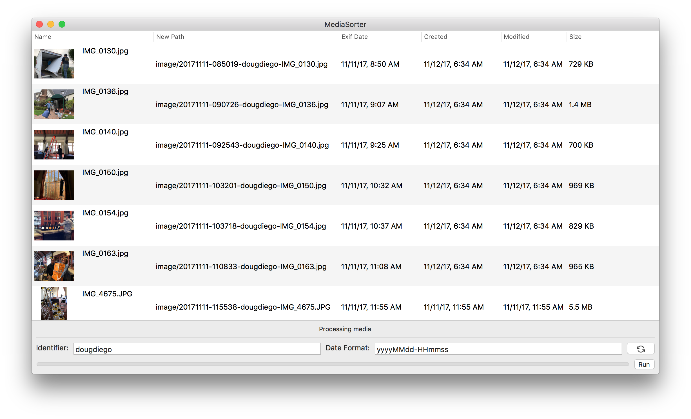
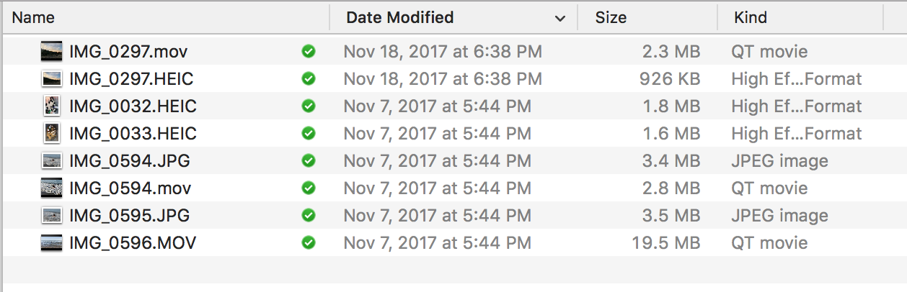
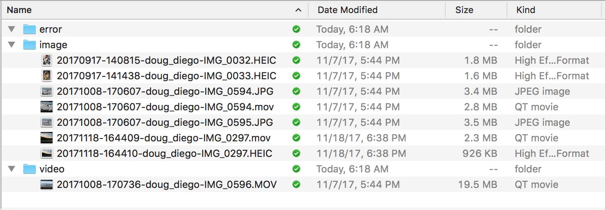

MediaSorter
=========

This is a pet project to sort my media according to my own workflow.  This used to be a set of scripts. Then Apple introduce the HEIC format and broke my scripts.  In order to get information like the create date of the photo and video, it was easiest to use Apple's frameworks ([CoreGraphics](https://developer.apple.com/documentation/coregraphics), [AVFoundation](https://developer.apple.com/av-foundation/)).  This mean writing an app.  I'm not an experienced Mac developer, but figured this would be a good project to learn.  Be nice.



[Download MediaSorter](Releases/MediaSorter-0.1.0.zip)


## My Workflow
I use iCloud Photos.  But it's not my main storage or backup.  It's where I keep my best photos.  When I pull out my iPhone to show someone a picture, I don't want to have to flip through tons photos that were taken to get the perfect shot.

Here's what I do:

1. Take pictures on my iPhone.
2. Photos sync with iCloud.
3. About every month I export all the photos since last export using Photos for the Mac.
4. Run this script.
5. Copy the files to a NAS
6. Go back to Photos and delete all but my favorite photos.

## File naming
Format:

```
<date>-<title>-<original_name>.<extension>
```

Example:

```
20170917-140815-doug_diego-IMG_0032.HEIC
```

**Date** I prefer to have the date first and in [ISO 8601](https://en.wikipedia.org/wiki/ISO_8601) format.  This allows for the images to be sorted in order.  The app lets you change the date format.

**Title**  This is optional. Sometimes I add extra context to the photos. 

**Original Filename** I found this is useful for a couple of reasons.  I found that photos taken in quick succession have the same date.  So the original file name gives them a different file name.  It's also useful in cases where I may have a SD Card with original images and need the filename to compare

Media is sorted into 3 directories:
* image - images and Live Photos
* video - vidoes (not videos associated with live photos)
* error - media that did not have Exif date.

I could use the create date for media without Exif date.  But I'd rather manually handle that case.  (Could be a future preference)

Note: Original images are not modified.  A copy is made.  It's up to you to manually delete what you like later.

**Example Input**


**Example Output**


## Requirements

* Xcode 9 or later (That's all I've tested on)
* Swift 4
* HEIC images only work on High Sierra.  If you run on Sierra and import a HEIC image, it will crash.

## Roadmap/Issues
* Better progresss when importing photos.  Should display progress.
* Drag photos or a folder to the window, instead of using the menu.
* After process photos, offer to open them in the finder.
* HEIC images crash on High Sierra.  Move them to Error directory and give explaination.  Or make High Sierra a requirement.
* Clean up menu items
* Code clean up.  Organize it better.  Fix all TODO's.
* Need an icon

## Support

None.  This is a pet project to organize my media.  But if you want to ask questions on GitHub, I might answer.

## Contributions
Contributions are welcome!  My only request is they don't break my workflow.  If you want to change things, please include a preference.